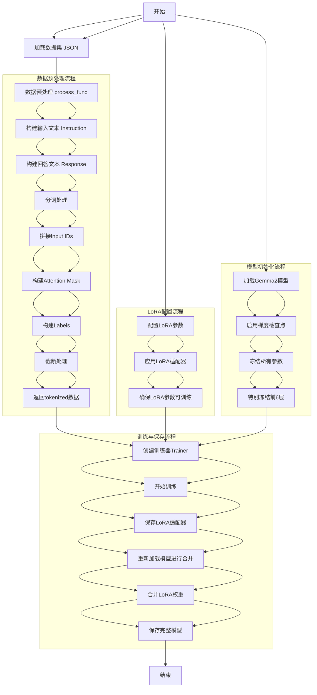

```mermaid
graph TD
    A[开始] --> B[加载数据集 JSON]
    B --> C[数据预处理 process_func]
    C --> D[构建输入文本 Instruction]
    D --> E[构建回答文本 Response]
    E --> F[分词处理]
    F --> G[拼接Input IDs]
    G --> H[构建Attention Mask]
    H --> I[构建Labels]
    I --> J[截断处理]
    J --> K[返回tokenized数据]
    
    L[加载Gemma2模型] --> M[启用梯度检查点]
    M --> N[冻结所有参数]
    N --> O[特别冻结前6层]
    
    P[配置LoRA参数] --> Q[应用LoRA适配器]
    Q --> R[确保LoRA参数可训练]
    
    K --> S[创建训练器Trainer]
    R --> S
    O --> S
    
    S --> T[开始训练]
    T --> U[保存LoRA适配器]
    U --> V[重新加载模型进行合并]
    V --> W[合并LoRA权重]
    W --> X[保存完整模型]
    X --> Y[结束]
    
    subgraph 数据预处理流程
        C --> D --> E --> F --> G --> H --> I --> J --> K
    end
    
    subgraph 模型初始化流程
        L --> M --> N --> O
    end
    
    subgraph LoRA配置流程
        P --> Q --> R
    end
    
    subgraph 训练与保存流程
        S --> T --> U --> V --> W --> X
    end
    
    A --> B
    A --> L
    A --> P
```

# 模型占用显存大小 = 模型本身 b 数 + 模型 b 数 * 浮点数精度占用字节数 + 梯度计算占用 + 优化器占用
# 其中一个 2b 浮点精度32位数占用字节数 = 4字节，也就是 2G * 4 ~= 8G
# 梯度计算和模型本身大小一样，约为 8G
# 优化器占用约为模型本身大小 * 2，约为 16G
# 共计 = 2 + 8 + 8 + 16 ~= 34G